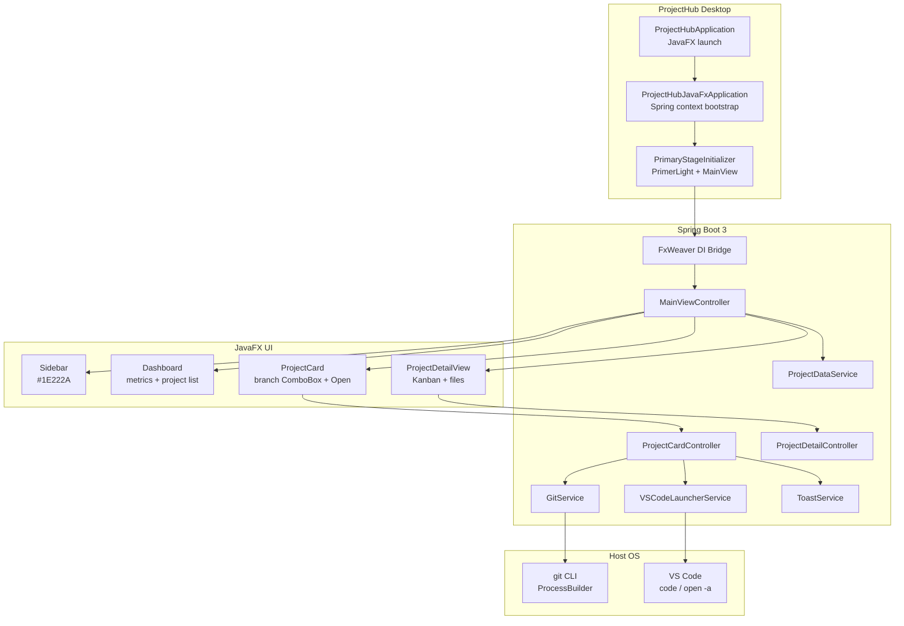

# cursor-ws

Multi-module Maven monorepo for Cursor desktop/apps work.

**Repository:** https://github.com/niteshjain132/cursor-ws

Each application lives in its own Maven module under this parent. Add new apps over time without creating separate repos.

```
cursor-ws/                 ← parent POM (com.cursorws:cursor-ws)
├── pom.xml
├── projecthub/            ← module 1: engineering dashboard (JavaFX)
├── <future-app>/          ← module 2, 3, … (add here)
└── README.md
```

## Modules

| Module | Artifact | Description |
|--------|----------|-------------|
| [`projecthub`](./projecthub) | `com.cursorws:projecthub` | macOS-native engineering dashboard (Java 21, Spring Boot 3, JavaFX 21, AtlantaFX) |

## Adding a new app module

1. Create a directory at the repo root, e.g. `myapp/`.
2. Add `myapp/pom.xml` with parent:

```xml
<parent>
    <groupId>com.cursorws</groupId>
    <artifactId>cursor-ws</artifactId>
    <version>1.0.0-SNAPSHOT</version>
</parent>
<artifactId>myapp</artifactId>
```

3. Register it in the root `pom.xml`:

```xml
<modules>
    <module>projecthub</module>
    <module>myapp</module>
</modules>
```

4. Build just that module: `mvn -pl myapp -am package`

Shared dependency versions belong in the parent `<dependencyManagement>` / `<properties>`.

## Architecture (ProjectHub)



### Layer summary

| Layer | Responsibility |
|-------|----------------|
| **Bootstrap** | `ProjectHubApplication` launches JavaFX; `ProjectHubJavaFxApplication` starts the Spring context and publishes `StageReadyEvent`. |
| **UI / FxWeaver** | Controllers annotated `@FxmlView` are Spring beans; FXML views are weaved via FxWeaver. |
| **Theme** | AtlantaFX `PrimerLight` + `styles/projecthub.css` (dark slate sidebar `#1E222A`). |
| **Services** | `GitService` runs `git branch -a` / `git checkout`; `VSCodeLauncherService` opens projects via `code` or macOS `open -a`. |
| **Navigation** | Card body click → `ProjectSelectedEvent` → `ProjectDetailView` (Kanban + repo files). Open button → VS Code only. |

## Prerequisites

- **JDK 21+**
- **Maven 3.8+**
- Graphical display (macOS desktop, or Linux with X11 / Xvfb for headless)
- Optional: Git CLI, VS Code (`code` on `PATH`, or installed as “Visual Studio Code” on macOS)

## Build

From the repository root:

```bash
# Compile all modules + run unit tests
mvn clean test

# Package executable Spring Boot JAR for ProjectHub
mvn -pl projecthub clean package

# Artifact
# projecthub/target/projecthub-1.0.0-SNAPSHOT.jar
```

## macOS standalone app (double-click to launch)

On a **MacBook** you can produce a native `ProjectHub.app` (and a `.dmg` installer) with JDK `jpackage`. The bundle **embeds a Java runtime**, so end users do not need JDK/Maven installed.

> `jpackage` must run **on macOS**. It cannot cross-build a `.app` from Linux/Windows.

```bash
./projecthub/scripts/package-macos.sh
```

| Artifact | Path |
|----------|------|
| App bundle | `projecthub/target/dist/ProjectHub.app` |
| Disk image | `projecthub/target/dist/ProjectHub-1.0.0.dmg` |

```bash
open projecthub/target/dist/ProjectHub.app
# or after install into Applications:
open -a ProjectHub
```

Maven profile (app-image only):

```bash
mvn -pl projecthub -Pmacos-app clean package
```

First Gatekeeper launch may require **Right-click → Open** (unsigned local build).

## Start (dev)

### Option A — Maven

```bash
mvn -pl projecthub spring-boot:run
```

### Option B — Packaged JAR

```bash
mvn -pl projecthub clean package -DskipTests
java -jar projecthub/target/projecthub-1.0.0-SNAPSHOT.jar
```

### Option C — Headless / CI

```bash
xvfb-run -a mvn -pl projecthub spring-boot:run
```

## Stop

| How you started | How to stop |
|-----------------|-------------|
| Foreground Maven / JAR | `Ctrl+C` |
| Standalone `.app` | `Cmd+Q` or ProjectHub → Quit |
| Background process | `pkill -f 'com.projecthub.ProjectHubApplication'` |

Closing the ProjectHub window also shuts down the Spring context and exits the JVM.

## ProjectHub usage

1. **Open in VS Code** — click **Open** on a project card.
2. **Switch branch** — pick a branch in the card `ComboBox`.
3. **Project detail** — click the card body to open Kanban + repository files.
4. **Back** — use **Back to Dashboard** on the detail view.

## Tests

```bash
mvn test
```

- `GitServiceTest` — branch list parsing / remote prefix normalization
- `VSCodeLauncherServiceTest` — missing-path handling and non-throwing launch attempts

## License

See repository `LICENSE` if present; otherwise all rights reserved by the authors.
