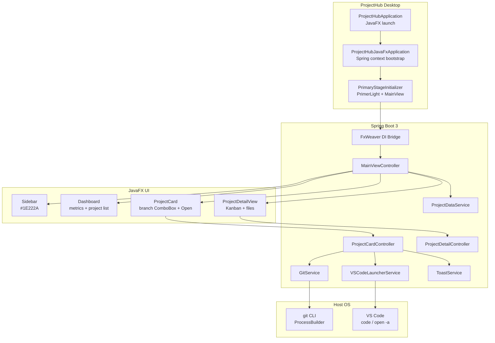

# cursor-ws

Cursor workspace monorepo hosting **ProjectHub** — a macOS-native engineering project dashboard built with Java 21, Spring Boot 3, JavaFX 21, and AtlantaFX.

## Modules

| Module | Artifact | Description |
|--------|----------|-------------|
| [`projecthub`](./projecthub) | `com.cursorws:projecthub` | Desktop dashboard with Git + VS Code integration |

## Architecture



### Layer summary

| Layer | Responsibility |
|-------|----------------|
| **Bootstrap** | `ProjectHubApplication` launches JavaFX; `ProjectHubJavaFxApplication` starts the Spring context and publishes `StageReadyEvent`. |
| **UI / FxWeaver** | Controllers annotated `@FxmlView` are Spring beans; FXML views are weaved via FxWeaver. |
| **Theme** | AtlantaFX `PrimerLight` + `styles/projecthub.css` (dark slate sidebar `#1E222A`). |
| **Services** | `GitService` runs `git branch -a` / `git checkout`; `VSCodeLauncherService` opens projects via `code` or macOS `open -a`. |
| **Navigation** | Card body click → `ProjectSelectedEvent` → `ProjectDetailView` (Kanban + repo files). Open button → VS Code only. |

## Prerequisites

- **JDK 21+**
- **Maven 3.8+**
- Graphical display (macOS desktop, or Linux with X11 / Xvfb for headless)
- Optional: Git CLI, VS Code (`code` on `PATH`, or installed as “Visual Studio Code” on macOS)

## Build

From the repository root (`cursor-ws`):

```bash
# Compile all modules + run unit tests
mvn clean test

# Package executable Spring Boot JAR for ProjectHub
mvn -pl projecthub clean package

# Artifact
# projecthub/target/projecthub-1.0.0-SNAPSHOT.jar
```

## Start

### Option A — Maven (dev)

```bash
mvn -pl projecthub spring-boot:run
```

### Option B — Packaged JAR

```bash
mvn -pl projecthub clean package -DskipTests
java -jar projecthub/target/projecthub-1.0.0-SNAPSHOT.jar
```

### Option C — Headless / CI (virtual framebuffer)

```bash
# Ensure a display is available, then:
xvfb-run -a mvn -pl projecthub spring-boot:run
```

On first launch you should see:

- Left sidebar with **ProjectHub** branding and navigation
- Dashboard metrics (Active Projects, Sprint Tasks, Releases, Velocity)
- Interactive project cards with branch selector and **Open**

## Stop

| How you started | How to stop |
|-----------------|-------------|
| Foreground Maven / JAR in a terminal | `Ctrl+C` |
| Background shell job | `kill $(pgrep -f 'projecthub\|ProjectHubApplication')` or `kill %1` |
| From another terminal | `pkill -f 'com.projecthub.ProjectHubApplication'` |

Closing the ProjectHub window also shuts down the Spring context and exits the JVM (`Application#stop`).

## ProjectHub usage

1. **Open in VS Code** — click **Open** on a project card (`code <path>`, with macOS `open -a "Visual Studio Code"` fallback).
2. **Switch branch** — pick a branch in the card `ComboBox`; ProjectHub runs `git checkout` and shows a toast.
3. **Project detail** — click the card body (not the dropdown/Open button) to open Kanban + repository files in-app.
4. **Back** — use **Back to Dashboard** on the detail view.

## Tests

```bash
mvn test
```

Key coverage:

- `GitServiceTest` — branch list parsing / remote prefix normalization
- `VSCodeLauncherServiceTest` — missing-path handling and non-throwing launch attempts

## License

See repository `LICENSE` if present; otherwise all rights reserved by the authors.
