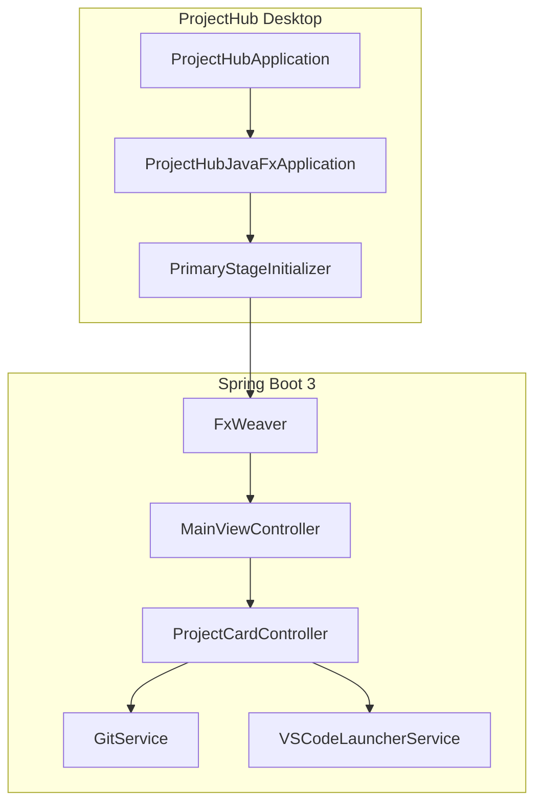

# ProjectHub

macOS-native engineering project dashboard built with **Java 21**, **Spring Boot 3**, **JavaFX 21**, and **AtlantaFX** (`PrimerLight`).

Self-contained Maven project — build from this folder (`projecthub/`), not a repo-root reactor.

## Stack

| Layer | Technology |
|-------|------------|
| Runtime | Java 21 |
| Application framework | Spring Boot 3.3 |
| UI | JavaFX 21 + FXML |
| DI bridge | FxWeaver (`javafx-weaver-spring-boot-starter`) |
| Theme | AtlantaFX PrimerLight |
| Icons | Ikonli Feather pack |
| Process execution | `ProcessBuilder` (Git + VS Code) |

## Architecture



## Features

- Dark slate sidebar (`#1E222A`) with ProjectHub branding and navigation
- Dashboard metrics: Active Projects, Sprint Tasks, Releases, Velocity
- Interactive project cards with progress, tech badges, git branch `ComboBox`, and **Open** (VS Code)
- Card body click opens an in-app `ProjectDetailView` (Kanban + repository files)
- `GitService`: `git branch -a` / `git checkout` with toast feedback
- `VSCodeLauncherService`: `code <path>` with macOS `open -a "Visual Studio Code"` fallback

## Build / test / run

From **`projecthub/`**:

```bash
mvn clean test
mvn spring-boot:run
```

Packaged JAR:

```bash
mvn clean package -DskipTests
java -jar target/projecthub-1.0.0-SNAPSHOT.jar
```

## Stop

`Ctrl+C` in the terminal, or close the window (`Cmd+Q` for the `.app`).

## macOS standalone `.app`

On a MacBook:

```bash
./scripts/package-macos.sh
# → target/dist/ProjectHub.app
# → target/dist/ProjectHub-1.0.0.dmg
open target/dist/ProjectHub.app
```

## Layout

```
src/main/java/com/projecthub/
  ProjectHubApplication.java
  javafx/          # JavaFX ↔ Spring bootstrap
  ui/main/         # MainView + controller
  ui/card/         # ProjectCard + controller
  ui/detail/       # ProjectDetailView + controller
  service/         # GitService, VSCodeLauncherService, …
  model/           # Project, Milestone, ActivityItem
```
